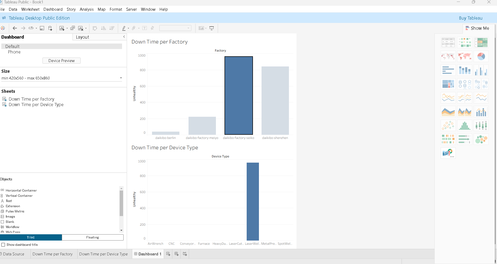
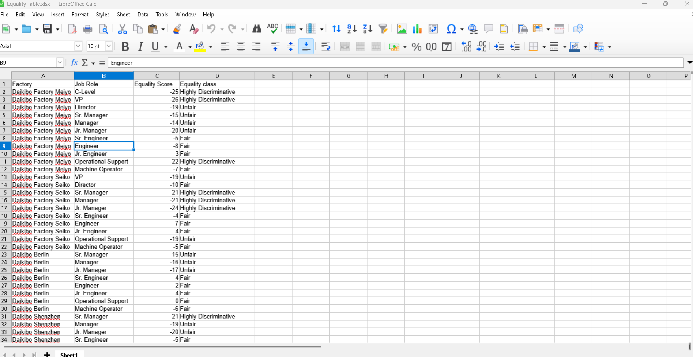
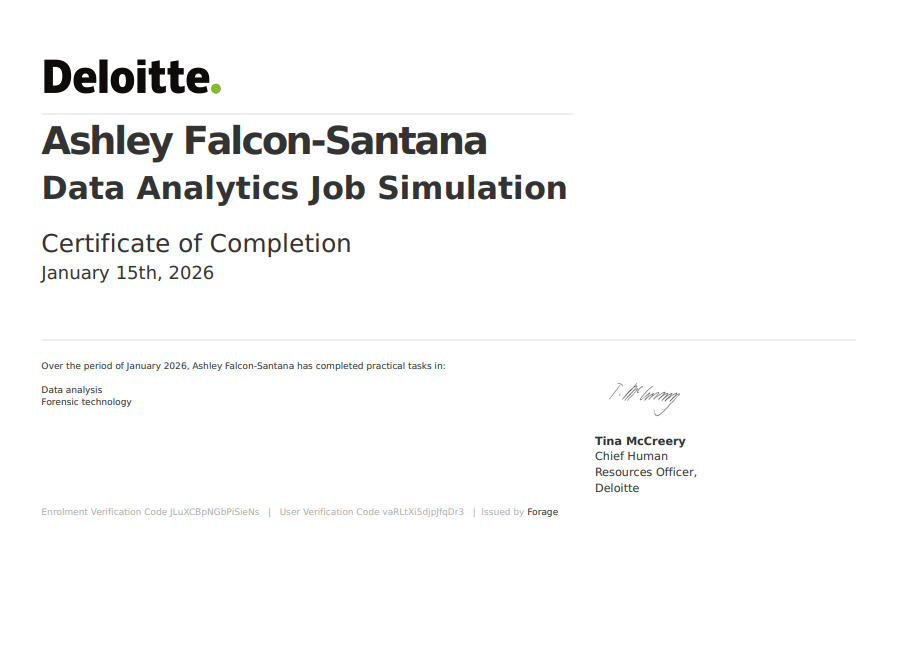

# Deloitte Data Analytics Virtual Internship
## Summary
This project is part of the Deloitte Australia Data Analytics Virtual Internship offered 
through Forage. It's a self paced job simulation that mirros real data analytics work done
by professionals at Deloitte, designed to help build practical analytical skills and earn a certificate to add to LinkedIn or a resume. Throughout the experience, I analyzed a dataset, drew insights, and used tools like Tableau and Excel to answer real business questions.

### Task 1 - Data Analysis & Dashboard (Tableau)
In this task, I was given telemetry data that represents operational information from a
client's machines and factories. My goal was to:

- Import the telemetry dataset into Tableau.
- Analyze the patterns in data (like machine downtime and performance).
- Build an interactive dashboard that helps answer insights about machine failure, downtime per factory, and downtime per device type.
- Customize calculated fields and filters so the dashboard tells a story about trends in the data.

In this task, we helped the client find out which location did machines break the most + what machines broke the most in that location.

**Outcome:**

When completing the task, it was found that the Seiko Factory was the location where laser welder machines broke down the most.

### Task 2 - Gender Pay Equality Analysis (Excel)
In this task, I analyzed employee compensation data to assess gender pay equality across a compnay's factories and job roles. My goal was to:

- Import and review the provided dataset containing factory, job role, and equality scores.
- Classify the equality scores into categories: Fair, Unfair, and Highly Discriminative.
- Add a new column in Excel (or LibreOffice Calc) to reflect these classifications and ensure the dataset clearly highlighted areas of concern.

**Outcome:**

Across the factories, it was found that executive and management roles show the highest pay discrimination, while technical, junior, and operational roles are generally the most fair, showing a clear pattern of greater inequality at higher responsibility levels.

## Certificate
Successfully completed the job simulation and earned a Certificate of Completion to showcase.

